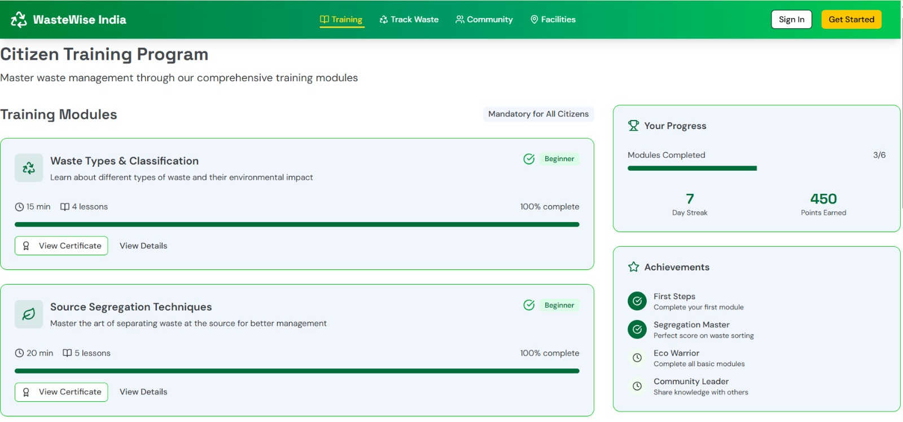

<html>
  <body>
    <h3 align="center">Team StackOverFlow Presents</h3>
    <h1 align="center">WasteWise</h1>
    <h3 align="center">India's Best Smart Waste Management App</h3>
    
    <h3>Features :-</h3>
      <ul>
        <li>Traning</li>
        <li>Track Waste</li>
        <li>Community</li>
        <li>Facilities</li>
      </ul>
    <h3>Technology Stack :-</h3>
      <ul>
        <li>📱 Front-end : Tailwind CSS, Next.js</li>
        <li>⚙️ Back-end : Node.js,Express.js</li>
        <li>🗂️ Database : PostgreSql</li>
      </ul>
     <h3>Benefits :-</h3>
      <ul>
        <li>🌍 Cleaner Environment</li>
        <li>👥 Citizen Participation</li>
        <li>🎓 Awareness & Education</li>
        <li>📊 Transparency </li>
        <li>♻️ Sustainability</li>
      </ul>
    <h2 align="center">“ A clean nation is a strong nation ”</h2>
  </body>
</html>
